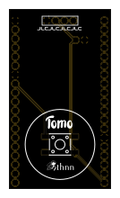
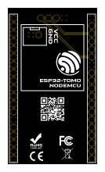
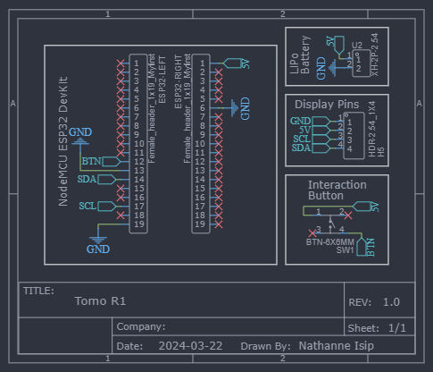

<p align="center">
    </p>
    <h1 align="center">Tomo</h1>
    <p align="center">Your Emotional Pet Companion</p>
</p>


[](https://github.com/nthnn/tomo/blob/main/LICENSE)
[](https://github.com/nthnn/tomo/blob/main/LICENSE)
<a href="https://www.buymeacoffee.com/nthnn"></a>


> An AI-like handheld interactable full of emotion companion pet made with ESP32 NodeMCU via Arduino Platform.

Tomo is an interactive handheld companion pet crafted using ESP32 NodeMCU and developed on the Arduino platform. This project aims to create a small, emotionally expressive device with a 0.96-inch monochromatic OLED display serving as its facial interface, and a momentary button for user interaction. The name "Tomo" is inspired by the Japanese character "友," which translates to "friend" or "companion," reflecting the nature of this delightful creation.

Tomo embodies the essence of companionship in a compact and accessible form factor, offering users a unique blend of technology and emotional connection. Its minimalist design and intuitive interaction model make it suitable for various applications, from personal entertainment to educational tools.

> [!NOTE]
> Tomo is a project developed for educational and recreational purposes. It is not a substitute for professional mental health support or therapy.

## Why Tomo?

- **Emotive Expressions**: Tomo boasts a range of facial animations displayed on its 0.96-inch OLED screen, allowing it to convey emotions and engage users in interactive experiences.

- **Interaction**: Users can interact with Tomo through a simple momentary button interface, enabling them to engage with its various expressions and behaviors.

## Getting Started

To get started with Tomo, follow these steps:

1. Download Tomo from this [link](https://github.com/nthnn/tomo) or clone the repository with the following command:

```bash
git clone https://github.com/nthnn/tomo --depth 1
```

2. Acquire a compatible board either from my website's [shop](https://nthnn.github.io/shop.html) or alternatively, you can fabricate your own board using the provided PCB gerber files and schematics located in the [pcb](pcb) directory.
3. Open the downloaded project repository using [PlatformIO](https://platformio.org/) extension on VS Code.
4. Connect your ESP32 NodeMCU board with the Tomo PCB shield securely plugged in.
5. Upload the Tomo firmware via PlatformIO.
6. Your Tomo is now ready!

## PCB Shield-style Design

| Board Front Design                    | Board Back Design                   |
|---------------------------------------|-------------------------------------|
|  |  |

## Schematic Diagram

You can get the printable PDF version of schematic diagram [here](pcb/tomo-schematic-diagram.pdf).

<p align="center">
    
</p>

## License

Your use of Tomo is subject to the terms and conditions of the following respective licenses. Make sure to comply with the licensing requirements when using or distributing Tomo.

* The firmware, including the header files and source files of Tomo, are all under the [GNU GPL v3.0 license](LICENSE/GNU%20GPL%20v3.0.txt).
* Asset files such as Tomo board preview images, logo, PCB preview, and Piskel facial animations are under the Creative Commons (CC BY-NC-SA 4.0).

    [Tomo](https://github.com/nthnn/tomo) © 2024 by [Nathanne Isip](https://github.com/nthnn) is licensed under [CC BY-NC-SA 4.0](http://creativecommons.org/licenses/by-nc-sa/4.0/?ref=chooser-v1)

* The schematic diagram (both in PDF and PNG format) and the PCB gerber file shall be under [CERN OHL Permissive v2 license](LICENSE/CERN%20OHL%20Permissive%20v2.txt).

---

<p align="center"><a href="https://github.com/nthnn/tomo">Tomo</a> &copy; 2024 by <a href="https://github.com/nthnn">Nathanne Isip</a></p>